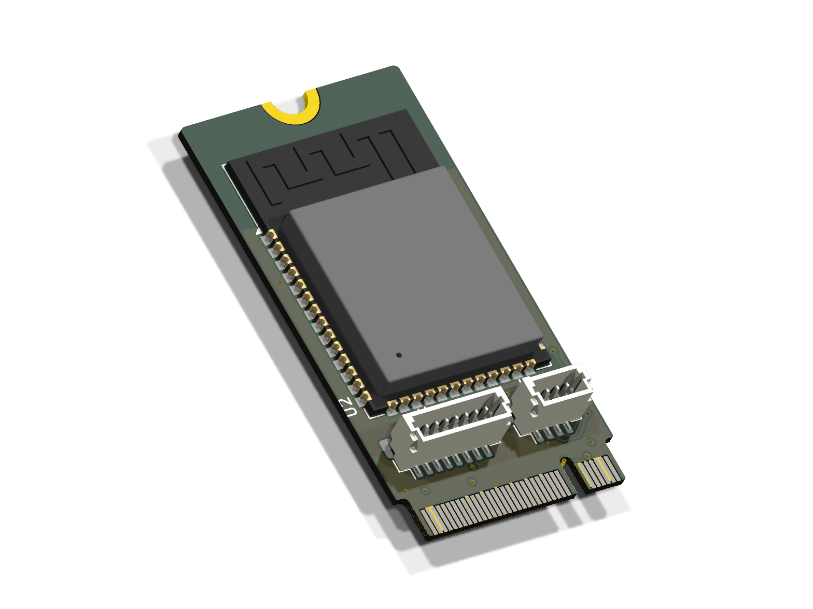
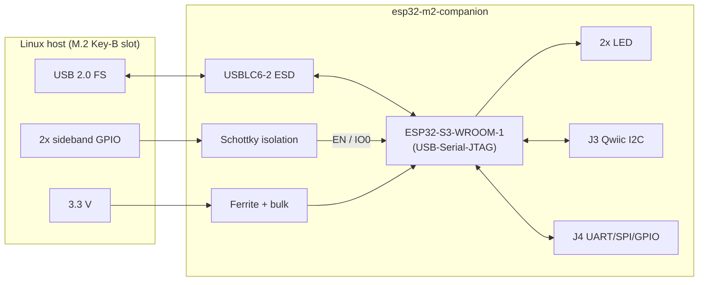
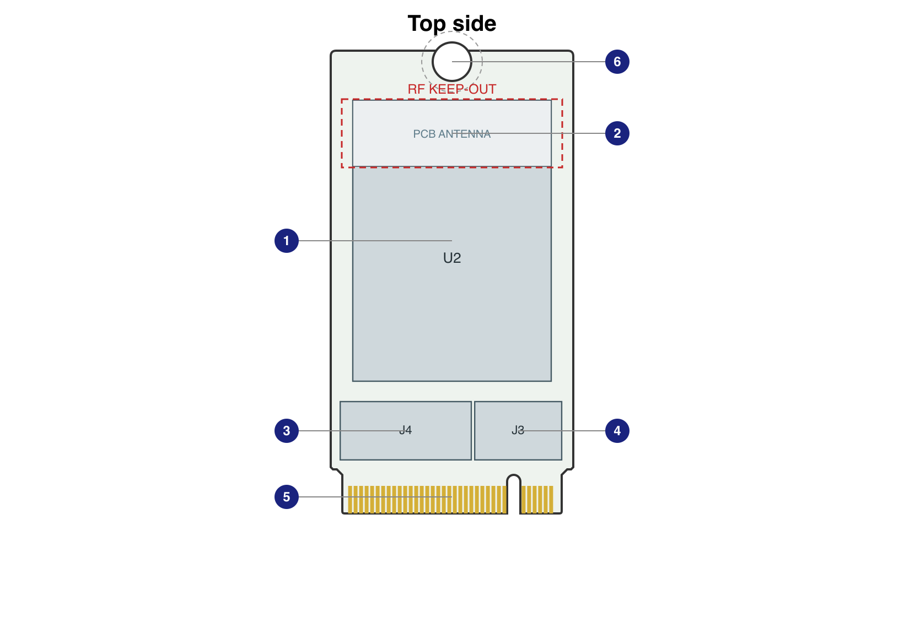
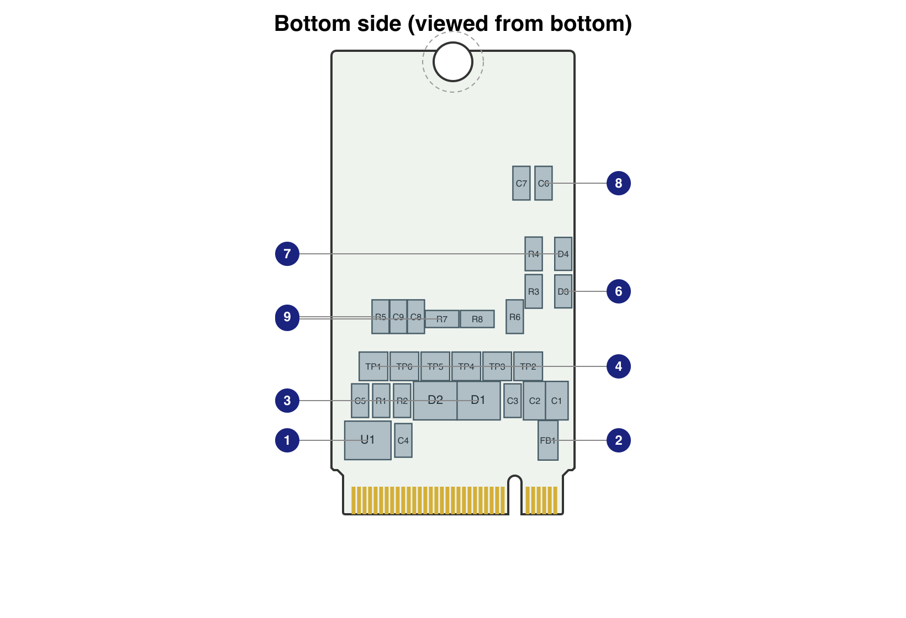
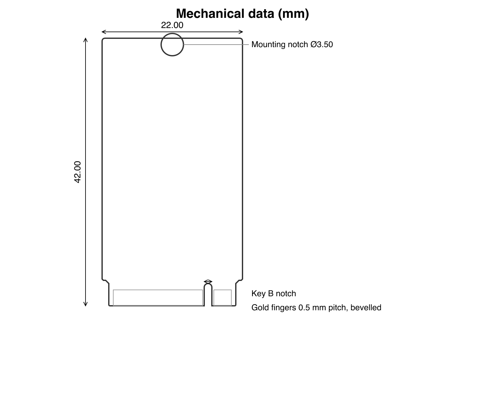

# ESP32 M.2 Companion — Datasheet

**M.2 Key-B 2242 USB companion microcontroller card**
Preliminary · rev `c5e5aa7-dirty` · 2026-08-31 · © 2026 Stefano Viola · CERN-OHL-P v2
*(generated by `make datasheet` — do not edit by hand)*

<p align="center"></p>

The card adds a fully host-controlled ESP32-S3 to any embedded Linux system
with an M.2 Key-B socket: it enumerates as a USB CDC device, is flashable and
even brick-recoverable purely from the host, and offloads realtime GPIO /
I2C / SPI / UART work — with Wi-Fi and Bluetooth LE included. Primary host:
Toradex Verdin family (Mallow carrier).

## Features

- **MCU**: ESP32-S3-WROOM-1-N8R2 — Xtensa dual-core 32-bit LX7 @ 240 MHz,
  single-precision FPU, 512 KB SRAM + 16 KB RTC SRAM, 384 KB ROM
- **Memory**: 8 MB quad-SPI flash, 2 MB quad-SPI PSRAM (in module)
- **Radio**: Wi-Fi 4 (802.11b/g/n, 2.4 GHz, up to 150 Mbps, up to
  20.5 dBm TX) · Bluetooth 5 LE + mesh · on-module PCB antenna
- **Host link**: USB 2.0 full-speed on the M.2 edge, native USB-Serial-JTAG
  → CDC console, `esptool` flashing, and JTAG debugging with zero extra parts
- **Host-controlled recovery**: reset (EN) and boot-strap (IO0) on M.2
  sideband pins, Schottky-isolated — a bricked card is reflashed entirely
  from the host, no buttons, no cables
- **IO**: Qwiic/STEMMA-QT I2C port (JST SH-4) + UART/SPI/GPIO port
  (JST SH-8), 3.3 V logic
- **Form factor**: M.2 Key-B 2242 (22 × 42 mm, 0.8 mm PCB, 4-layer),
  single 3.3 V supply from the slot
- **Open source hardware** (CERN-OHL-P v2), schematic-as-code (SKiDL),
  assembled by JLCPCB

## Block diagram



## Specifications

| Parameter | Value | Source |
|---|---|---|
| Supply voltage | 3.3 V ±5 % from M.2 edge (no on-card regulator) | SPEC §6.2 |
| Supply current | ~95 mA Wi-Fi RX · ~355 mA avg TX @ 20.5 dBm (bursts higher) · design budget 500 mA | WROOM DS Table 6-4 |
| Host interface | USB 2.0 full-speed (12 Mbps), CDC-ACM via USB-Serial-JTAG | WROOM DS §Pin Definitions |
| Logic level (IO ports) | 3.3 V (not 5 V tolerant) | ESP32-S3 DS |
| Wi-Fi | 802.11b/g/n 2.4 GHz (2412–2484 MHz), ≤150 Mbps, ≤20.5 dBm | WROOM DS §7.1 |
| Bluetooth | 5 (LE) + mesh, ≤20 dBm | WROOM DS §7.2 |
| Operating temperature | −40 … +85 °C (module limit) | WROOM DS Table 1-1 |
| Dimensions | 22 × 42 mm (M.2 2242), 0.8 mm PCB | M.2 EM spec |
| Height (top) | 4.2 mm max (JST headers; module 3.1 mm) — ≈6.3 mm with SH plug mated | JST eSH catalog |
| Height (bottom) | ≤1.5 mm — within the 2.54 mm B-side allowance of an H4.2 socket | M.2 EM spec Fig 38 |
| ESD (USB lines) | IEC 61000-4-2 level 4 (USBLC6-2SC6) | ST/UMW DS |

> **Height note**: the module (3.1 mm) exceeds the M.2 1.5 mm top-side
> envelope. The card fits open sockets (e.g. Mallow X17, carrier bottom) but
> **not** enclosed hosts (laptops) — see `docs/risks.md` R11.

## M.2 edge interface (used pins)

Only the pins below are electrically used; the full 75-position table with
the standard WWAN mapping is in [`docs/pinmap.md`](docs/pinmap.md).

| Pin | Name (card) | Net | Function |
|---|---|---|---|
| 2 | VCC_3V3 | +3V3_M2 | 3.3 V supply in |
| 3 | GND | GND | Ground |
| 4 | VCC_3V3 | +3V3_M2 | 3.3 V supply in |
| 5 | GND | GND | Ground |
| 7 | USBH3_D_P | USBH3_D_P | USB 2.0 D+ |
| 9 | USBH3_D_N | USBH3_D_N | USB 2.0 D− |
| 11 | GND | GND | Ground |
| 20 | PCIE_1_GPIO_5 | PCIE_1_GPIO_5 | Boot-mode strap (IO0), active-low, diode-isolated |
| 27 | GND | GND | Ground |
| 33 | GND | GND | Ground |
| 39 | GND | GND | Ground |
| 45 | GND | GND | Ground |
| 50 | PERST_n | PERST_n | Card reset (EN), active-low, diode-isolated |
| 51 | GND | GND | Ground |
| 57 | GND | GND | Ground |
| 70 | VCC_3V3 | +3V3_M2 | 3.3 V supply in |
| 71 | GND | GND | Ground |
| 72 | VCC_3V3 | +3V3_M2 | 3.3 V supply in |
| 73 | GND | GND | Ground |
| 74 | VCC_3V3 | +3V3_M2 | 3.3 V supply in |

Sideband inputs are Schottky-isolated with on-card 10 kΩ pull-ups: any host
may **pull them low** (open-drain / drive-low-then-release); a host must not
hold them push-pull high below 2.8 V. Unconnected sidebands = normal boot.

### Recovery sequence (bricked firmware)

```
host: IO0-strap GPIO -> low          # M.2 pin 20 (or pin 8)
host: pulse PERST# low >= 5 ms       # M.2 pin 50
      -> ROM download mode -> esptool.py over the same USB port
host: release both (Hi-Z)            # normal boot
```

On Mallow: PERST# = SODIMM 244 (free it from the PCIe DT node);
pin 20 reaches the SoM via the X16.19 jumper. Details: ADR 0002.

## IO connectors

### J3 — Qwiic / STEMMA-QT I2C (JST SH-4, BM04B-SRSS-TB)

| Pin | Signal | Function |
|---|---|---|
| 1 | GND | Ground |
| 2 | +3V3 | 3.3 V out (card rail) |
| 3 | IO8 | I2C SDA |
| 4 | IO9 | I2C SCL |

Standard Qwiic pinout — off-the-shelf sensor cables plug in directly.
I2C pull-ups are DNP on-card (Qwiic peripherals provide their own);
footprints R5/R6 (10 k) can be fitted if needed.

### J4 — UART / SPI / GPIO (JST SH-8, BM08B-SRSS-TB)

| Pin | Signal | Function |
|---|---|---|
| 1 | TXD0 | UART0 TX (ROM console) |
| 2 | RXD0 | UART0 RX |
| 3 | IO10 | GPIO / SPI CS (FSPICS0) |
| 4 | IO11 | GPIO / SPI MOSI (FSPID) |
| 5 | IO12 | GPIO / SPI CLK (FSPICLK) |
| 6 | IO13 | GPIO / SPI MISO (FSPIQ) |
| 7 | IO14 | GPIO (FSPIWP) |
| 8 | IO21 | GPIO (RTC-capable) |

Both connectors are vertical (top-entry) 1.0 mm JST SH: plugs mate
perpendicular to the card and can be (un)plugged with the card in the slot.
UART0 doubles as the ROM bootloader console. The SPI set is the native
FSPI IOMUX group (up to 80 MHz).

## Product views

<p align="center"></p>

| # | Top side |
|---|---|
| 1 | ESP32-S3-WROOM-1-N8R2 module |
| 2 | Module PCB antenna + RF keep-out zone |
| 3 | J4 - UART / SPI / GPIO (JST SH-8, top entry) |
| 4 | J3 - Qwiic / STEMMA-QT I2C (JST SH-4, top entry) |
| 5 | M.2 Key-B card edge (75-pos, USB 2.0 + sidebands) |
| 6 | Mounting notch (M.2 screw, GND pad) |

<p align="center"></p>

| # | Bottom side |
|---|---|
| 1 | USBLC6-2 USB ESD protection |
| 2 | 3.3 V entry filter + bulk capacitors |
| 3 | Recovery diodes (EN / IO0 sideband isolation) |
| 4 | Test points: EN, IO0, TXD0, RXD0, 3V3, GND |
| 5 | USB series resistors (0R) |
| 6 | Power LED (green, side-view, emits from left edge) |
| 7 | Status LED (red, IO48, side-view, emits from left edge) |
| 8 | Module 3V3 decoupling |
| 9 | DNP provisions (I2C pull-ups, USB shunt C) |

## Mechanical data

<p align="center"></p>

| Parameter | Value |
|---|---|
| Card size | M.2 Type 2242: 22.00 × 42.00 mm |
| PCB | 0.8 mm, 4-layer (SIG/GND/PWR/SIG), ENIG + bevelled gold fingers |
| Max height, top side | 4.2 mm (JST SH headers) · ≈6.3 mm with plug mated |
| Max height, bottom side | ≤1.5 mm (compliant with H4.2 socket B-side envelope) |
| Socket coverage zone | first 4.8 mm from card edge kept component-free (both faces) |
| Mounting | M.2 screw, Ø3.5 semicircular notch, plated GND pad |
| Component sides | SMT both sides (top: module + connectors; bottom: passives) |

## LEDs & test points

| Item | Location | Function |
|---|---|---|
| Green LED (D3) | side-view, left card edge | 3.3 V rail present |
| Red LED (D4) | side-view, left card edge | firmware status, active-low on IO48 |
| TP1/TP2 | bottom | EN / IO0 (recovery without host sidebands) |
| TP3/TP4 | bottom | UART0 TX / RX |
| TP5/TP6 | bottom | 3.3 V / GND |

The LEDs are side-view parts emitting out of the left card edge — visible
with the card in the slot regardless of mounting orientation. Test points
are on the bottom side (bench use).

## Host compatibility

| Host | Status |
|---|---|
| Toradex Verdin + Mallow (X17) | Primary — verified pin mapping, recovery documented |
| Any M.2 Key-B slot with USB 2.0 | Enumerates and flashes; recovery needs 2 host GPIOs (or TPs) |
| RPi 5 + Waveshare Key-B HAT | Nice-to-have (ADR 0004) — USB works, 2242 standoff & sidebands unverified |
| Enclosed hosts (laptops/WWAN bays) | **Not compatible** — height (R11) |

## Design data

Schematic PDF (`make sch`), interactive 3D, BOM (`make check`), layout and
all sources in this repository. License: CERN-OHL-P v2.
