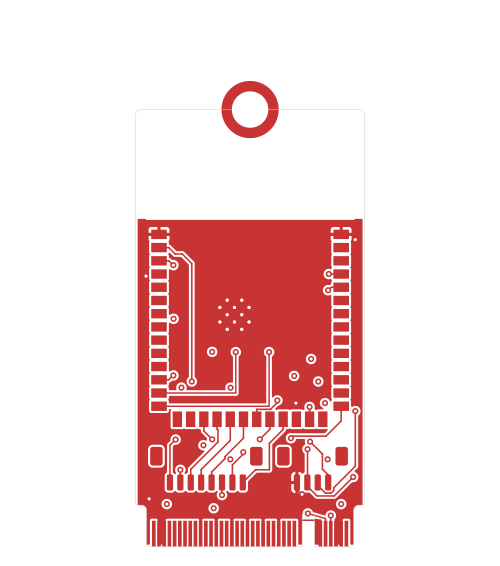
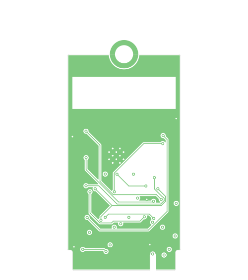
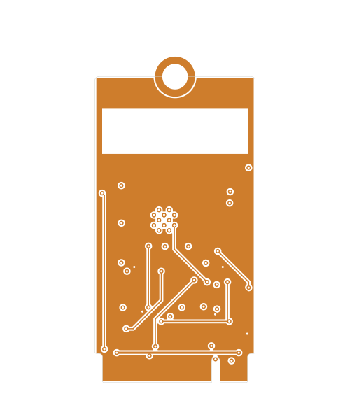
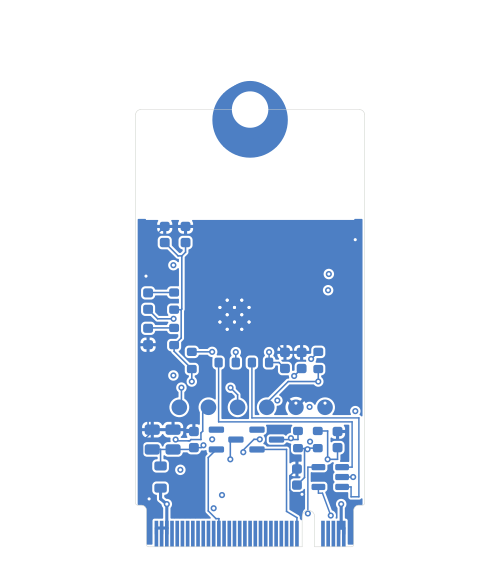

# Layer stackup & routing

4-layer, 0.8 mm, **SIG / GND / PWR / SIG** — JLCPCB **JLC04081H-3313** stackup.
Layer renders below are generated from the routed board
(`hardware/kicad/esp32_m2_companion.kicad_pcb`); regenerate with `make render`
plus the per-layer export in `docs/`. Blue = copper.

## Stackup (top → bottom)

| # | Layer | Copper | Role | Notes |
|--:|---|---|---|---|
| 1 | **F.Cu** (top) | 1 oz | Signal + components | Module, JST connectors; short signal runs. Prepreg **3313, 0.0994 mm, εr 4.1** to L2 → sets the USB microstrip impedance |
| 2 | **In1.Cu** | 0.5 oz | **Solid GND plane** | Continuous reference for the USB pair; the reason the diff pair is clean. Core (NP-155F) below |
| 3 | **In2.Cu** | 0.5 oz | **+3V3 power plane** | Card 3.3 V rail (post-ferrite); every +3V3 pad vias to here |
| 4 | **B.Cu** (bottom) | 1 oz | Signal + components | Most routing; all passives, USBLC6, diodes, LEDs, test points |

- Board thickness **0.8 mm** (M.2 requirement).
- **USB pair** `USBH3_D_P/N` / `USB_D_P/N`: 90 Ω differential, **0.14 mm width /
  0.14 mm gap**, routed on the outer layers referenced to the L2 GND plane, no
  stubs (SPEC §6.3). Verify against JLCPCB's impedance calculator at order.
- **Impedance control** enabled at order (±10 %, free at JLCPCB).

## The four copper layers

### 1 — F.Cu (top signal)

Component pads for the module (U2) and the two JST connectors (J3/J4), plus
short top-side signal segments. The dashed rectangle at the top is the antenna
keep-out (no copper under the module antenna).

### 2 — In1.Cu (GND plane)

Solid ground pour — the USB pair's return-current reference. Kept continuous
under the signal layers; the antenna region is excluded.

### 3 — In2.Cu (+3V3 power plane)

The 3.3 V card rail. Every +3V3 component pad reaches this plane through a via,
so power distribution is the plane, not surface traces.

### 4 — B.Cu (bottom signal)

Where most of the routing lives. The gold fingers are at the bottom edge; the
3×3 dot grid under the module is the EPAD ground-via array (thermal + GND,
Espressif HDG). Thin traces threading the GND pour are the signal routes.

## How this was routed

Hand-routed + locked: the USB differential pair (impedance-critical) and the
recovery/boot nets; autorouted (freerouting, 80 passes): the header/UART/LED
signals; planes poured last. Method and the lessons behind it:
[`routing-method.md`](routing-method.md). Full source of truth for every
track/via is the KiCad PCB file — open it in the PCB Editor to explore
interactively (click a net to highlight it end-to-end).
